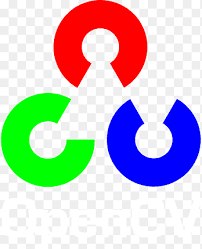

<h1 align="center">
  
</h1>

<h5 align="center">
  <code><a href="https://www.linkedin.com/in/vanshika-gupta-836006321/" title="LinkedIn Profile"> LinkedIn</a></code>
  <code><a href="/README.md" title="CodeForces Profile"> CodeForces</a></code>
  <code><a href="https://github.com/VanshikaGupta001/" title="Github Profile"> Instagram</a></code>
  <code><a href="https://www.instagram.com/iitz_vanshika/" title="Instagram Profile"> Instagram</a></code>

</h5>

  

🚀 **About Me**

I'm an AI/ML enthusiast, currently working on cutting-edge projects involving intelligent agents, computer vision, and applied machine learning. My GitHub is a space where I experiment, build, and open-source tools and research-driven solutions. I thrive on pushing boundaries and connecting ideas across domains. I don’t just code to build—I build to **solve real problems creatively and fast**.

---

🧠 **What I'm Currently Building**

- 🧠 Autonomous AI agents (planning–execution–reflection loop)
- 🛰️ Real-time change detection using satellite/drone imagery
- 🧑‍⚖️ Intelligent courtroom simulation with LLMs
- 🤖 Deep learning-based Virtual Try-On and emotion-aware avatars

---

🔍 **What I'm Exploring**

- 🧠 Advanced ML/DL workflows
- 📚 DSA (Data Structures & Algorithms)
- 🧠 Vision-Language Models (VLMs)
- 🛡️ Cybersecurity & Ethical Hacking
- 🤖 Agentic RAG Systems
- 🛰️ Quantum Communication

---

<h2 align="center">💡 Passion Areas 💡 </h2>

`AI/ML` • `Quantum Computing` • `Creative Technology` • `LLMs` • `Automation` • `Web Developemnt` • `Cybersecurity` • `Open source contributions`

<h2 align="center">🔥 Tech Stacks 🔥</h2>
 

  <code></code>
  <code></code>
  <code></code>
  <code></code>
  <code></code>
  <code></code>
  <code></code>
  <code></code>
  <code></code>
  <code></code>
  <code></code>
  <code></code>
  <code></code>
  <code></code>
  <code></code>
  <code></code>
  <code></code>
  <code></code>
  <code></code>
  <code></code>
  <code></code>
  <code></code>
  <code></code>
  <code></code>
  <!-- <code></code> -->
  <!-- <code></code> -->
  <!-- <code></code> -->
  <!-- <code></code> -->
  <!-- <code></code> -->
  <!-- <code></code> -->
  <!-- <code></code> -->
  <!-- <code></code> -->
  <!-- <code></code>
  <code></code> -->
  <!-- <code></code> -->
  <!-- <code></code> -->
  <!-- <code></code> -->
  <!-- <code></code>
  <code></code> -->

## 📈 GitHub Stats

🤝 Always up for collaborations and brainstorming bold ideas!

---
